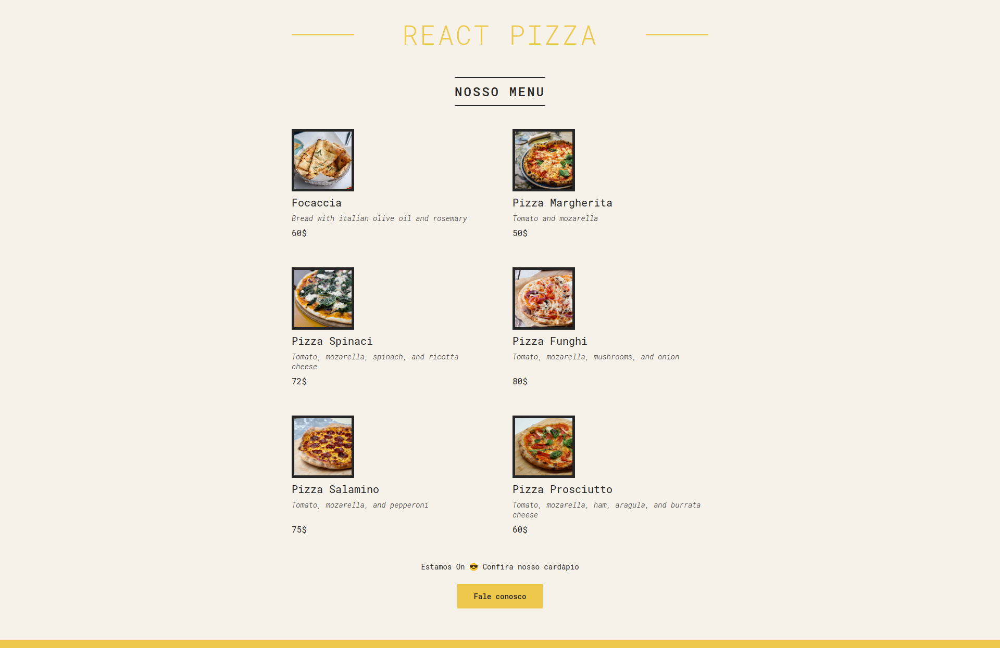

# Pizza Menu com React.Js

Projeto inicializado com o Create React App [Create React App](https://github.com/facebook/create-react-app).

## Scripts

Dentro do diretório, você pode rodar:

### `yarn start`

Obs:. Não esqueça de rodar "yarn install" ou "npm install".

Executa o aplicativo no modo de desenvolvimento.\
Abra [http://localhost:3000](http://localhost:3000) para visualizá-lo em seu navegador.

## Descrição

O objetivo deste projeto é trabalhar com alguns fundamentos do React JS, como JSX, Props e estilização básica, importando um arquivo CSS externo.

## Resultado final

🚀✨
